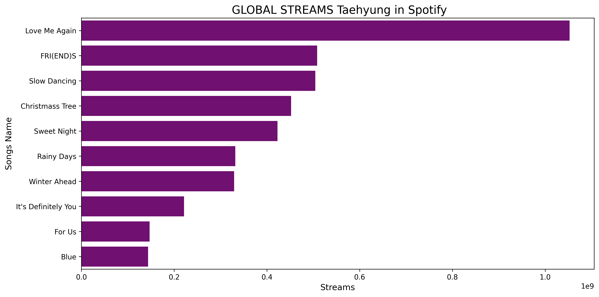

# 🎧 Taehyung Spotify Stream Analysis

This simple data visualization project presents the global stream counts of Taehyung's songs on Spotify using Python, Pandas, Matplotlib, and Seaborn.

## 📊 Chart Preview

## 📁 Project Files

- `taehyung_spotify_analysis.ipynb`: The Jupyter Notebook with code and visualizations.
- `chart.png`: Bar chart showing the number of streams per track.

## 🔧 Tools Used

- Python
- Pandas
- Matplotlib
- Seaborn
- Jupyter Notebook

## 💜 About

This is part of my journey in learning data analysis and showcasing my love for BTS and Taehyung through data! 👑✨
